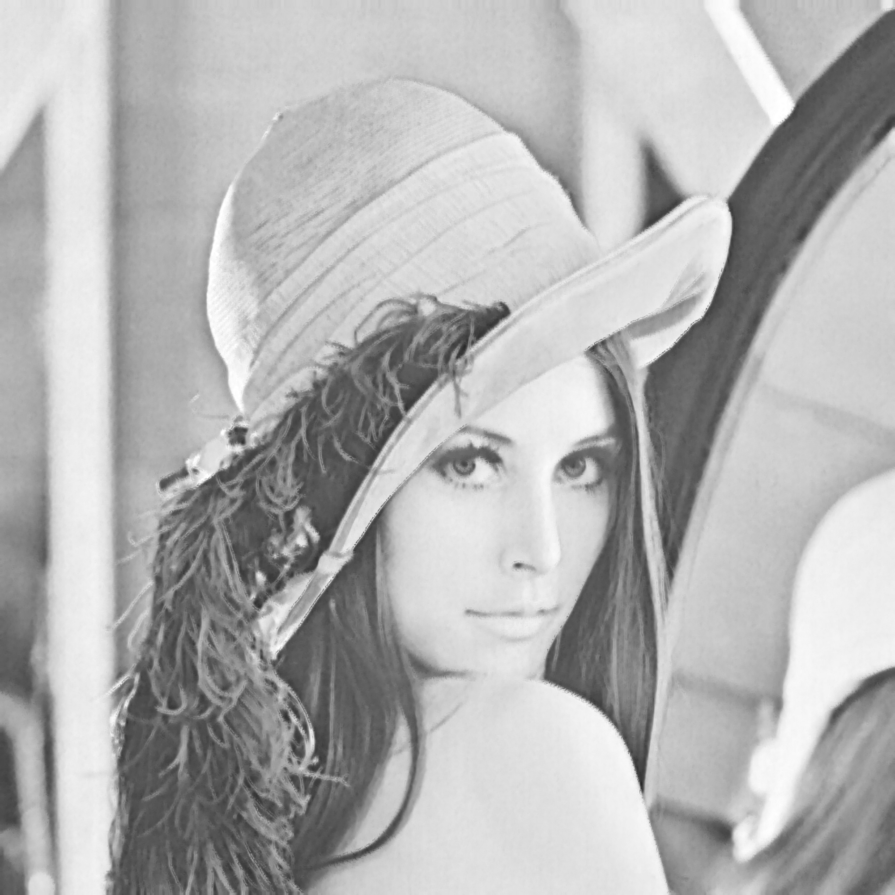
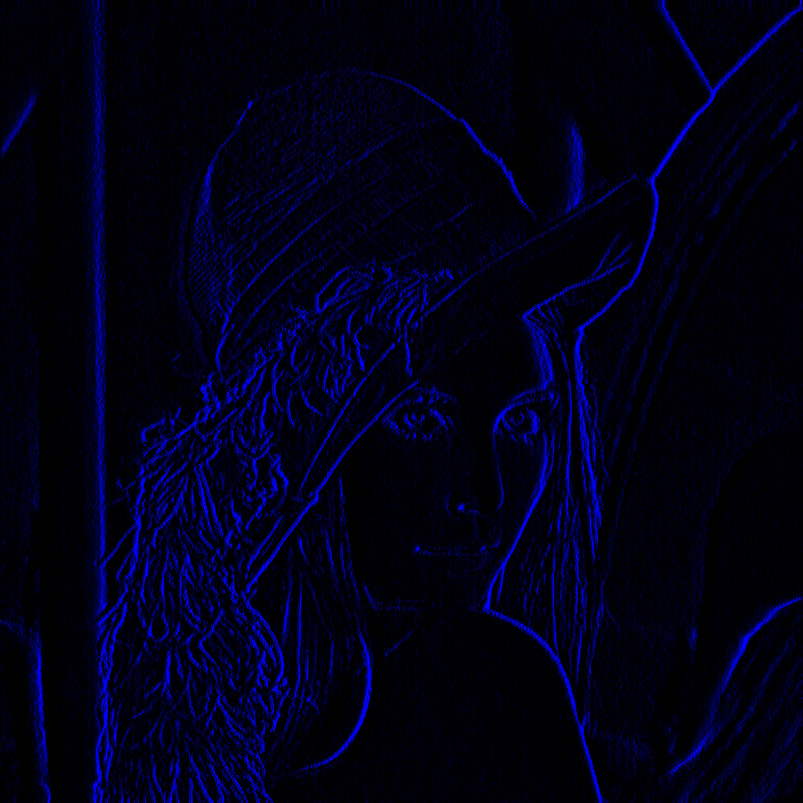

# CG_1

Рухович Игорь

381808-1

Отчёт по лабораторной работе №1. Обработка изображений.

Был создан абстрактный класс `Filter`, реализующий применение фильтра к изображению и содержащий:

- Функцию `protected virtual void DoPreprocessing(FastBitmap bmp)`, выполняющую предварительные расчеты перед проходом по изображению
- Функцию `protected abstract Color CalculateNewPixelColor(FastBitmap bmp, int x, int y)`, вызываемую в каждой точке изображения.

На основе этого класса были реализованы несколько точечных фильтров, а именно

- Инверсия цветов:

- "Серый мир":

- Линейная коррекция:

- Поворот на 45 градусов против часовой стрелки:

- "Стекло":

- Медианный фильтр. Для создания изображения берутся значения только из красного канала, для каждого пикселя берутся все значения в заданном радиусе и выбирается (за O(n)) медиана. Затем медианное значение записывается во все каналы:

Также на основе класса `Filter` был реализован класс `MatrixFilter`, с возможностью задания матрицы (в конструкторе) для расчёта нового пикселя. Были реализованы следующие матричные фильтры:

- Размытие. Эффект практически незаметен на большом изображении:

- Размытие по Гауссу. Эффект намного более заметен:

- Тиснение (для более чёткой видимости к данной картинке применён фильтр линейного растяжения после тиснения):

- Светящиеся края (выделение контуров + фильтр максимума; реализованы одним фильтром):

- Медианный фильтр + светящиеся края. На изображении намного меньше шума, но теряются 2 других цветовых канала:

На основе класса `Filter` также реализован класс  `MorphologyFilter`, применяющий к изображению операции морфологии (наращивание, эрозию и их комбинации). Для этого сначала изображение приводится к бинарному с помощью такой команды `binaryImage[x, y] = col.R <= 127 && col.G <= 127 && col.B > 127`, затем выполняется операция морфологии и в результате выводится изображение, где белый цвет означает `false`, а синий - `true`. Тут структурный элемент - это прямоугольник $3 \times 3$:

- Наращивание:

- Эрозия:

- Размыкание (эрозия + наращивание):

- Замыкание (наращивание + эрозия):

- Морфологический градиент:

Также присутствует возможность выбрать структурный элемент для операций морфологии. Для этого необходимо подать на вход программе изображение в любом формате, высота и ширина которого не превышают 7 пикселей. Оно будет преобразовано к бинарному по следующему условию `structElement[x, y] = color.R == 0`. Лучше всего различия в структурном элементе видно при применении операции морфологического градиента:

- Структурный элемент - прямоугольник $3 \times 3$, размеры фигуры -  $3 \times 3$:

- Структурный элемент - прямоугольник $1 \times 3$, но размеры фигуры -  $3 \times 3$:

- Структурный элемент - прямоугольник $1 \times 2$ (центральный и нижний пиксели), но размеры фигуры -  $3 \times 3$:

И, напоследок, картинка, получившаяся в результате экспериментов (фильтр светящихся границ, чередующийся с тиснением). Что-то похожее на неоновую вывеску:

