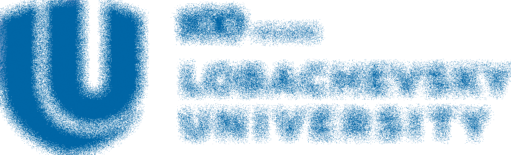
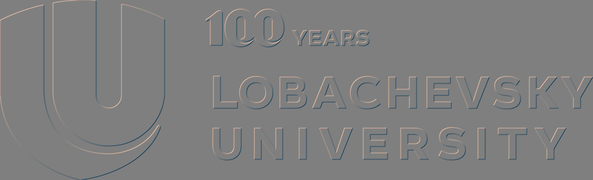
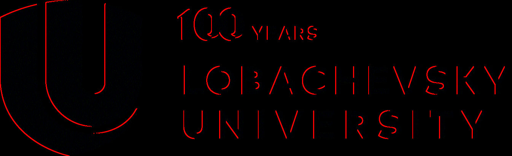
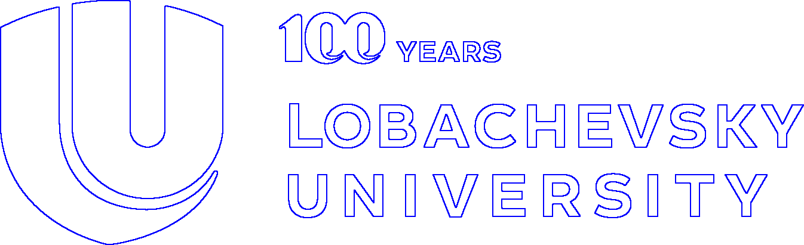
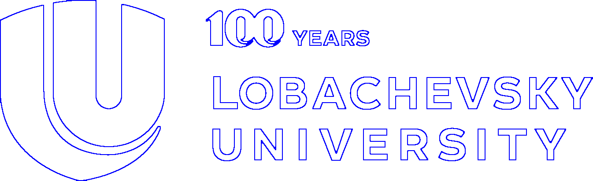
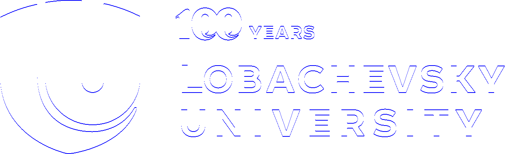
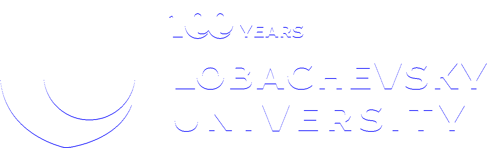
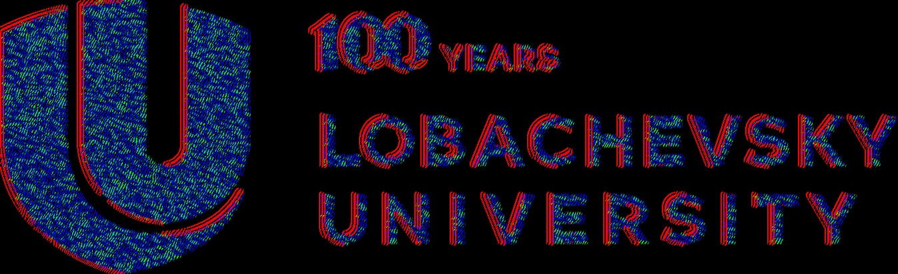

# CG_1

Рухович Игорь

381808-1

Отчёт по лабораторной работе №1. Обработка изображений.

Все примеры будут продемонстрированы на данном исходном изображении:
 

Был создан абстрактный класс `Filter`, реализующий применение фильтра к изображению и содержащий:

- Функцию `protected virtual void DoPreprocessing(FastBitmap bmp)`, выполняющую предварительные расчеты перед проходом по изображению
- Функцию `protected abstract Color CalculateNewPixelColor(FastBitmap bmp, int x, int y)`, вызываемую в каждой точке изображения.

На основе этого класса были реализованы несколько точечных фильтров, а именно 

Исходное изображение выглядело так:

На основе класса `Filter` были реализованы следующие точечные фильтры:

- Инверсия цветов: 
- "Серый мир":
- Идеальный отражатель: (без изображения. Не получилось найти подходящее)
- Линейная коррекция: (без изображения. Не получилось найти подходящее)
- Поворот на 45 градусов против часовой стрелки:
- "Стекло":
- Медианный фильтр:

Также на основе класса `Filter` был реализован класс `MatrixFilter`, с возможностью задания матрицы для расчёта нового пикселя. Были реализованы следующие матричные фильтры:

- Размытие:
- Размытие по Гауссу:
- Тиснение:
- Светящиеся края:

На основе класса `Filter` также реализован класс  `MorphologyFilter`, применяющий к изображению операции морфологии (наращивание, эрозию и их комбинации). Также присутствует возможность выбрать структурный элемент для операций морфологии (из графического изображения). Для следующих изображений использовался прямоугольник $3 \times 3$, полностью заполненный пикселями. Получились такие результаты:

- Наращивание:
- Эрозия:
- Размыкание (эрозия + наращивание):
- Замыкание (наращивание + эрозия):
- Морфологический градиент (наращивание - эрозия):
- Морфологический градиент + замыкание:

Лучше всего различия в структурном элементе видно на изображениях с градиентом:

- Градиент при структурном, с закрашенным прямоугольником $1 \times 3$:
- Градиент при структурном элементе с закрашенным прямоугольником $1 \times 2$ (центральный и нижний пиксели):

И, напоследок, картинка, получившаяся в результате экспериментов (фильтр светящихся границ, чередующийся с тиснением). Что-то похожее на неоновую вывеску: